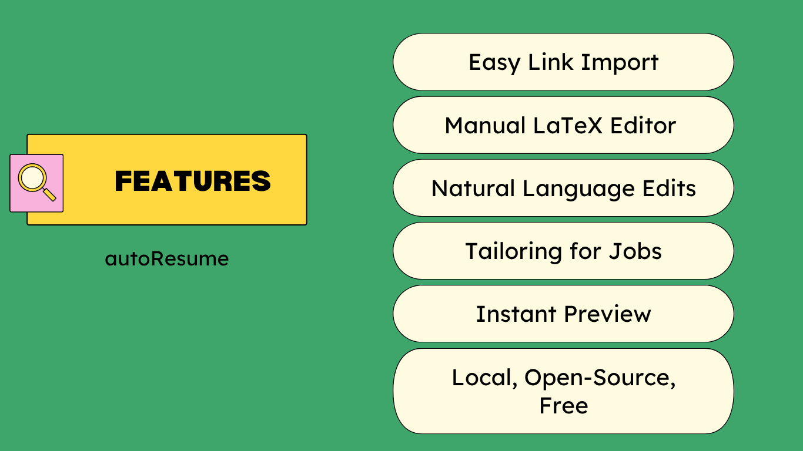

<p align="center">
  
</p>

<h1 align="center">autoResume</h1>

<p align="center">
  <b>Open‑source resume builder, paste your links, edit manually, and let AI lend a hand with polishing, updating, and tailoring your resume.</b>
</p>

---

### How to use this?

[Medium Blog Link](https://medium.com/@aadyachinubhai/autoresume-copy-and-paste-links-its-that-simple-8e50e6d155a1)

The Blog is outdated with respect to the User Interface and Template used.

## Features



---

## Getting Started

### Prerequisites
- [Docker](https://www.docker.com/get-started)
- [Docker Compose](https://docs.docker.com/compose/)

### Setup

1. Clone the repository:
   ```bash
   git clone https://github.com/aadya940/autoresume.git
   cd autoresume
   ```
2. Build and start the app:
   ```bash
   docker compose up --build
   ```
3. Access the apps:
   
   [_http://localhost:5173_](http://localhost:5173)
---

## Usage

1. Open autoResume in your browser.
2. Click on the :gear: icon, paste in your [GOOGLE API KEY](https://aistudio.google.com/) and your Email. 
3. Paste links to your professional information (e.g., Github, Personal Website, etc.).
4. Optionally, add feedback or a job posting link for further customization.
5. Click <b>Generate Resume</b> and let the AI do the rest!

---

## License

This project is licensed under the Apache 2.0 License.

## Contributing Guide

### Frontend
- Implement React components in the `frontend/src/components/` folder
- We use Chakra UI to implement components.
- Import and use your components in `frontend/src/App.jsx`

### Backend
- Implement API routes in the `backend/src/routes/` directory
- Add AI functionality in the `backend/src/ai/` directory
- We use the `black` code formatter for Python code
- Keep route handlers clean and logic separate

### General Guidelines
- Create a new branch for your feature/fix: `git checkout -b your-branch-name`
- Write clear commit messages
- Test your changes before submitting a PR

### Submitting Changes
1. Create a Pull Request
2. In your PR description, include:
   - What changes you made
   - Why you made them
   - Any relevant screenshots or test results
   - Any breaking changes or migration steps needed

We appreciate your contributions and will review your PR as soon as possible!
